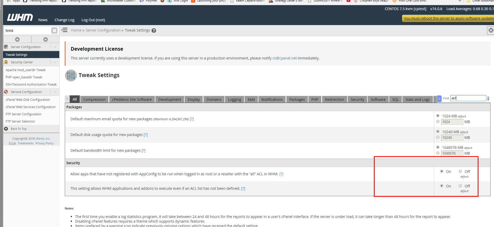
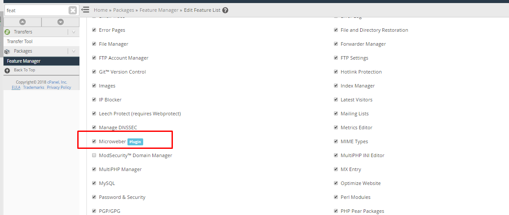
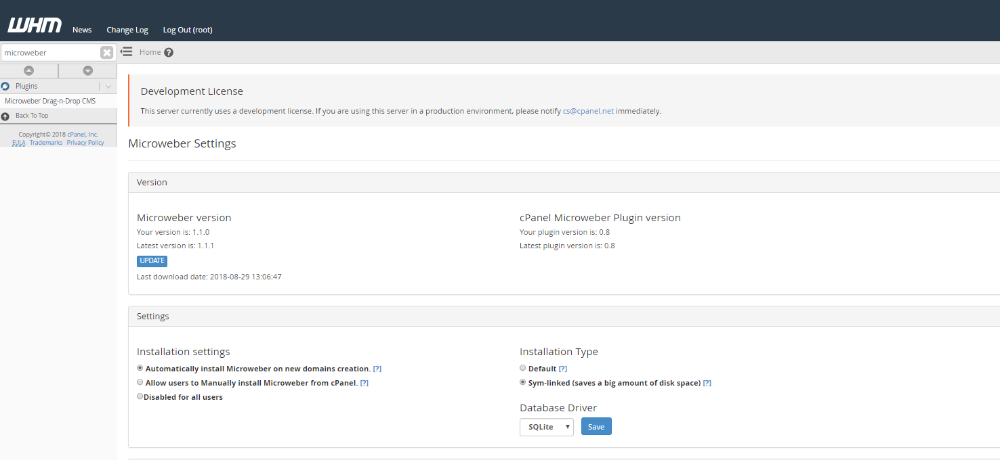
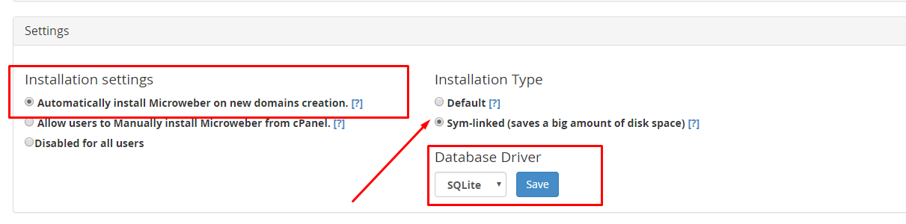

# cPanel Microweber Plugin

## Installation

### Using RPM

Run the following commands in the Terminal:

```
wget http://download.microweberapi.com/cpanel/microweber-cpanel.rpm
sudo yum install microweber-cpanel.rpm
```
 
### Manual installation

* Get the plugin source code from [microweber-dev/cpanel-plugin](https://github.com/microweber-dev/cpanel-plugin).
* Place the files in `/usr/local/cpanel/microweber`.
* Run the following script:

```
/usr/local/cpanel/microweber/install/installer.sh
```

## Find The Plugin

* Login to WHM, search for "Microweber" and open the plugin settings page.
* Add the "Microweber" feature to plans you wish to have Microweber installed with them.
* Login to cPanel and open the plugin under "Software". From that page Microweber can be manually installed to any of the user's domains.


### Update 

```
wget http://download.microweberapi.com/cpanel/microweber-cpanel.rpm
sudo rpm -Uvh microweber-cpanel.rpm
```

### Uninstall
 
* Run the following script:

```setup_acl.png
/usr/local/cpanel/microweber/install/uninstall.sh
```


 
# Usage 

### You may need to enable the ACL 

### After that go in feature manager and add the "Microweber" feature to a plan of your choice 

### And you can search for microweber 

### You can now setup your database type and install type 


And you are ready. 

Now if you make new domain with a plan that has the "microweber" feature, you will see a website created automatically. 


