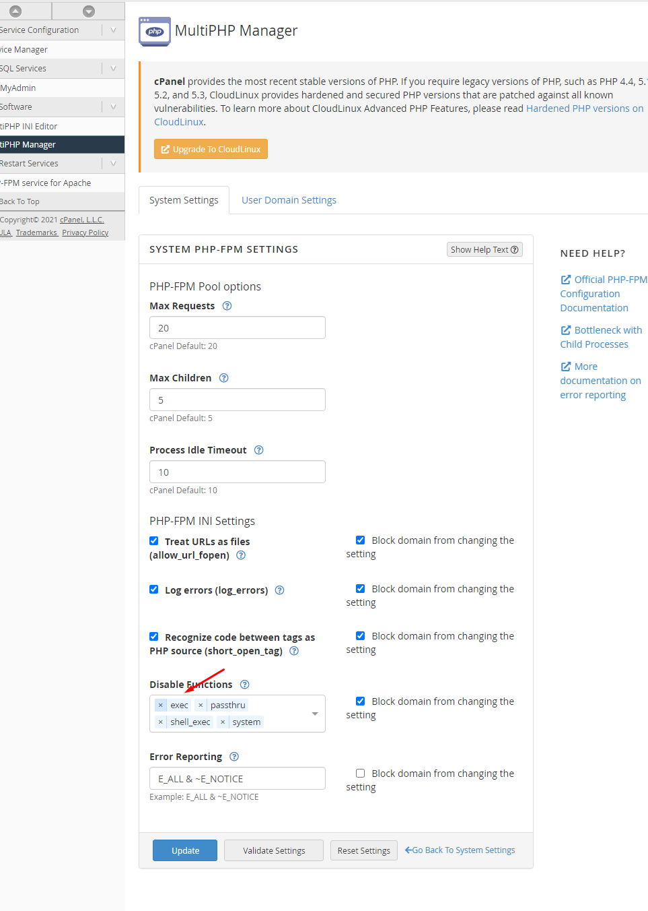

## SElinux setup

You must run this command `semanage permissive -a httpd_t`

and then 

`chcon --user system_u --type httpd_sys_content_t -R  /usr/share/microweber`

## CageFS  setup

edit th file `/etc/cagefs/cagefs.mp` and those folders in the list 

```
/usr/share/microweber
/usr/share/microweber/latest
/usr/share/microweber/latest/userfiles/modules
/usr/share/microweber/latest/userfiles/templates
```
 
Then run 

```
/usr/sbin/cagefsctl --reinit
/usr/sbin/cagefsctl --enable-all
/usr/sbin/cagefsctl --force-update
```


## Set symlink enforce_symlinksifowner

```
sysctl -w fs.enforce_symlinksifowner=0
```
 
## Enable exec

Go to Home  > Software > MultiPHP Manager and enable exec command
 


 